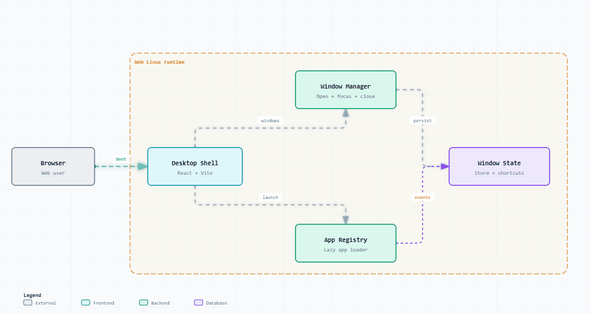

# Web Linux — 纯前端沉浸式浏览器桌面模拟系统

> **React 18 + TypeScript + Vite · 沉浸式多窗口调度与边缘吸附 · 20+ 内置实用工具与经典游戏 · Zustand 集中状态管理**

Web Linux 是一个基于 React、TypeScript 和 Vite 构建的现代化浏览器端桌面操作系统模拟器。项目在 Web 浏览器内完整还原了桌面 OS 的交互范式，包括开机引导、用户认证、桌面与开始菜单、统一任务栏、多窗口层级调度，以及丰富的基础工具与经典小游戏套件。

---

## ✨ 核心特性

- 🖥️ **完整系统桌面生命周期**：包含仿真开机启动、用户密码登录（默认密码 `linux`）、桌面网格、开始菜单分类导航与全局快捷启动。
- 🪟 **高级多窗口管理引擎**：支持窗口自由拖拽、多向边缘缩放、最小化/最大化/关闭、Z-Index 层级聚焦、任务栏实时状态联动与边缘智能吸附。
- 🛠️ **全套基础与开发工具链**：
  - **基础套件**：Terminal 模拟终端、File Manager 文件管理、Text Editor 文本编辑、Sticky Notes 便签、Calculator 计算器、Calendar 日历、Clock 时钟、Search 搜索。
  - **开发工具**：Code Editor 代码编辑器、Task Manager 进程监控、JSON Formatter 格式化、Regex Tester 正则测试器、Password Generator 密码生成器、Markdown Preview 实时预览、Base Converter 进制转换器、Image Viewer 图像查看器。
- 🎮 **内置经典独立游戏集合**：桌面 Game 目录集中收纳 7 款经典小游戏（扫雷 Minesweeper、2048、贪吃蛇 Snake、俄罗斯方块 Tetris、纸牌 Solitaire、数独 Sudoku、国际象棋 Chess）。
- 🎨 **统一图标与设计规范**：采用 `lucide-react` 统一应用矢量图标映射，结合 CSS 变量与现代毛玻璃拟态质感。

---

## 🚀 快速开始

### 1. 安装与启动本地开发环境

```bash
# 安装依赖
npm install

# 启动本地开发服务
npm run dev
```

### 2. 访问与登录

打开终端输出的本地地址（通常为）：

```text
http://localhost:5173/
```

- **系统默认登录密码**：`linux`

### 3. 常用质量验证命令

```bash
# TypeScript 类型检查
npx tsc -b

# ESLint 代码规范扫描
npm run lint

# 生产环境打包构建
npm run build
```

---

## 📂 项目结构

```text
web-linux/
├── src/
│   ├── apps/                   # 20+ 内置独立应用与游戏源码
│   │   ├── terminal/           # 模拟终端与 Linux 命令响应
│   │   ├── fileManager/        # 虚拟文件浏览器
│   │   ├── codeEditor/         # 代码编辑器
│   │   ├── jsonFormatter/      # JSON 校验与美化
│   │   ├── regexTester/        # 正则表达式实时匹配工具
│   │   ├── markdownPreview/    # Markdown 渲染器
│   │   ├── minesweeper/        # 经典扫雷
│   │   ├── 2048/               # 2048 数字方块
│   │   └── ...                 # 其余工具与小游戏实现
│   ├── stores/                 # Zustand 状态切片 (窗口状态、系统配置)
│   ├── system/                 # 系统核心层 (桌面网格、开始菜单、任务栏、窗口管理器、App注册表)
│   ├── styles/                 # 全局样式、主题变量与动画
│   ├── assets/                 # 静态图标与壁纸资源
│   ├── App.tsx                 # 根组件与视图分发
│   └── main.tsx                # 应用启动入口
├── docs/                       # 架构设计与文档资产
│   └── architecture/           # 动态系统架构图与交互设计资产
├── public/                     # 静态公共资源与 SVG 图标集
├── ARCHITECTURE.md             # 系统架构设计详细说明书
├── vite.config.ts              # Vite 构建配置
└── package.json                # 工程依赖清单
```

---

## 🛠️ 技术栈 / 技术原理

- **核心框架**：React 18、TypeScript 5
- **构建工具**：Vite 5
- **状态管理**：Zustand（集中管理窗口位置、层级堆叠、任务栏聚焦与应用状态）
- **图标与样式**：`lucide-react`、原生 CSS Variables、Tailwind 样式规范
- **代码质量**：ESLint、TypeScript Project References

---

## ⚠️ 已知限制与边界声明

- **虚拟文件系统**：File Manager、Text Editor 和 Terminal 目前使用各自的模拟内存数据，尚未打通全局统一持久化的虚拟文件系统（IndexedDB / LocalStorage）。
- **进程与系统资源**：Task Manager 中的 CPU/内存占用与进程列表为前端模拟数据。
- **组件分包与懒加载**：当前应用属于同步注册加载，生产构建存在主 bundle chunk 大于 500 kB 提示，后续可通过动态 `import()` 与代码分割（Code Splitting）进行性能优化。

---

## 🏗️ 动态系统架构图



- 🌐 [打开交互式动态架构图](docs/architecture/dynamic-archify-architecture.html)
- 📊 [查看架构源数据 (JSON)](docs/architecture/dynamic-archify-architecture.json)
